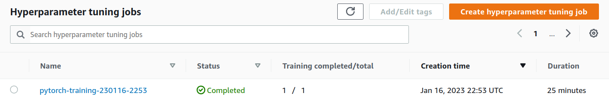
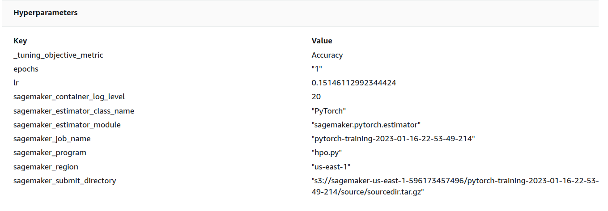
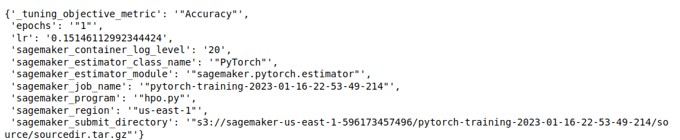
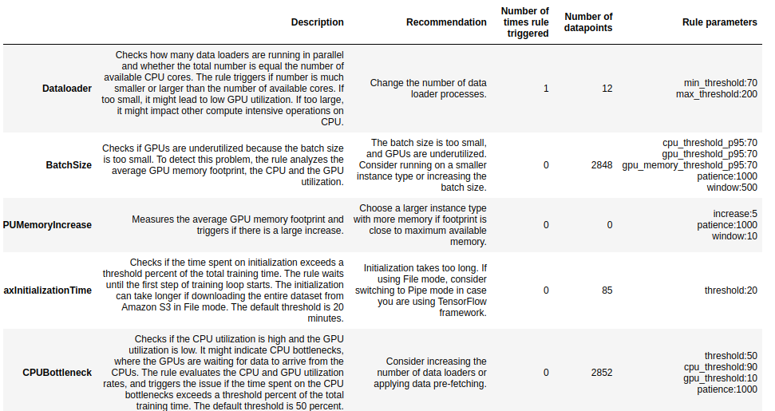
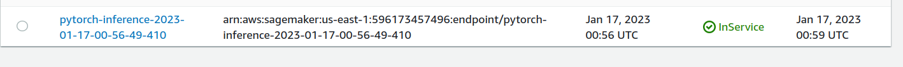

# Image Classification using AWS SageMaker

Use AWS Sagemaker to train a pretrained model that can perform image classification by using the Sagemaker profiling, debugger, hyperparameter tuning and other good ML engineering practices. This can be done on either the provided dog breed classication data set or one of your choice.

## Project Set Up and Installation
Enter AWS through the gateway in the course and open SageMaker Studio. 
Download the starter files.
Download/Make the dataset available. 

## Dataset
The provided dataset is the dogbreed classification dataset which can be found in the classroom.
The project is designed to be dataset independent so if there is a dataset that is more interesting or relevant to your work, you are welcome to use it to complete the project.

### Access
Upload the data to an S3 bucket through the AWS Gateway so that SageMaker has access to the data. 

## Hyperparameter Tuning
What kind of model did you choose for this experiment and why? Give an overview of the types of parameters and their ranges used for the hyperparameter search

As can be seen from the above screenshots, I have tuned the two parameters; learning rate and number of epochs

Remember that your README should:
- Include a screenshot of completed training jobs
- Logs metrics during the training process
- Tune at least two hyperparameters
- Retrieve the best best hyperparameters from all your training jobs

Best hyperparameters are shown in the below image 

## Debugging and Profiling
**TODO**: Give an overview of how you performed model debugging and profiling in Sagemaker
At first, I set the appropriate debug mode in both training and evaluation functions in train.py 

Next, I created a trial in the notebook. Finally, I created the profiler based on the trial. It was exported to s3 bucket. I then imported it to the notebook. 

### Results
**TODO**: What are the results/insights did you get by profiling/debugging your model?
Training took 1432 seconds 

The following table shows a profiling summary of the Debugger built-in rules. The table is sorted by the rules that triggered the most frequently. During your training job, the Dataloader rule was the most frequently triggered. It processed 12 datapoints and was triggered 1 times.

Dataloader was the only triggered rule. It was triggered once. 

**TODO** Remember to provide the profiler html/pdf file in your submission.
Done 

## Model Deployment
**TODO**: Give an overview of the deployed model and instructions on how to query the endpoint with a sample input.

I deployed a model trained on the best hyperparameters. In order to query this endpoint, a sample image is provided to the endpoint after preprocessing. The inference2.py file handles the input, model prediction and the returning of prediction. 

**TODO** Remember to provide a screenshot of the deployed active endpoint in Sagemaker.

## Standout Suggestions
**TODO (Optional):** This is where you can provide information about any standout suggestions that you have attempted.
